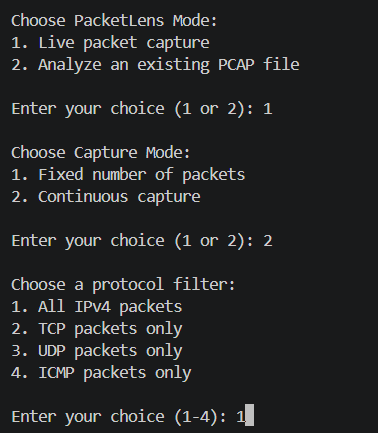
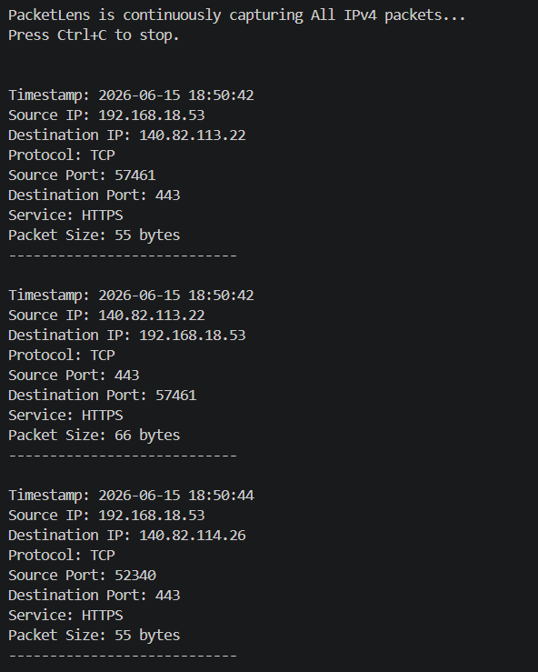
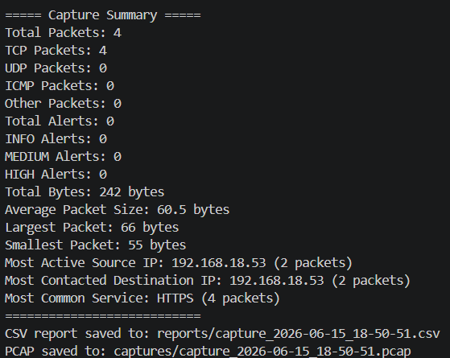
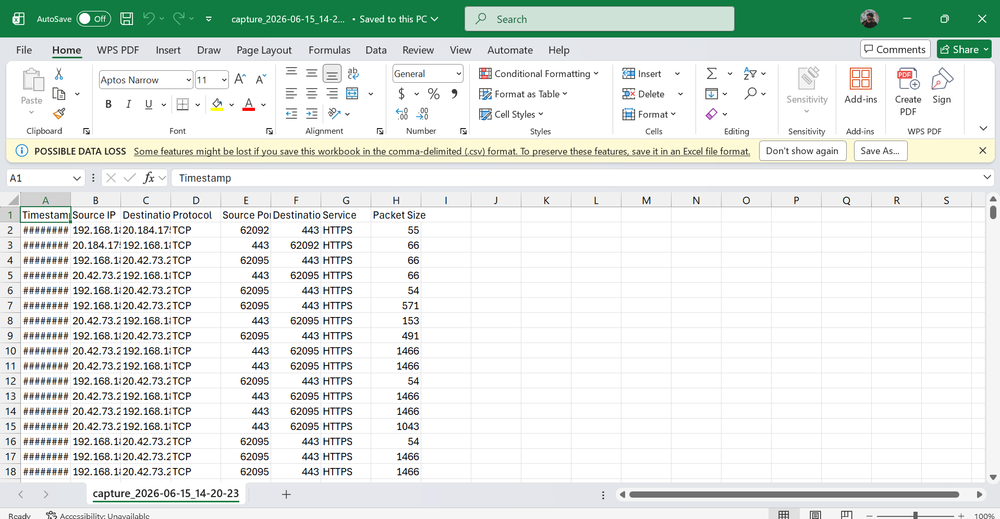
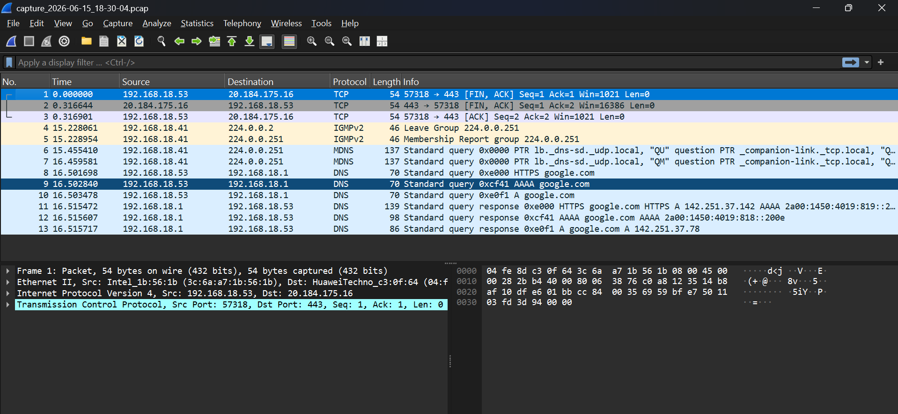

# PacketLens

PacketLens is a Python-based network traffic analyzer built with Scapy. It captures live IPv4 traffic, analyzes saved PCAP files, identifies common protocols and services, calculates traffic statistics, and generates rule-based security alerts for suspicious behavior.

## Features

- Live IPv4 packet capture
- Fixed-count and continuous capture modes
- TCP, UDP, ICMP, and other protocol detection
- Source and destination IP extraction
- Source and destination port extraction
- Common service identification
- Packet timestamp and size tracking
- Capture statistics and traffic summaries
- Most active source IP detection
- Most contacted destination IP detection
- Most common service detection
- CSV report generation
- PCAP file saving
- Offline PCAP analysis
- Rule-based security alerts:
  - Unusual destination ports
  - High packet rate to one destination port
  - Repeated traffic to sensitive services
  - Possible multi-port scanning
  - Possible TCP SYN scanning
- Alert severity levels: INFO, MEDIUM, and HIGH
- Alert cooldown to reduce repeated warnings

## Project Structure

```text
PacketLens/
├── main.py
├── packet_analyzer.py
├── detection.py
├── exporters.py
├── config.py
├── requirements.txt
├── README.md
├── ETHICAL_USE.md
├── captures/
└── reports/
```

## Requirements

- Windows 10 or Windows 11
- Python 3.10 or newer
- Npcap
- Scapy
- Wireshark, optional but recommended for opening PCAP files

## Installation

### 1. Clone the repository

```bash
git clone https://github.com/AnnsGilani/PacketLens.git
cd PacketLens
```

### 2. Create a virtual environment

```powershell
py -m venv venv
```

### 3. Activate the virtual environment

PowerShell:

```powershell
Set-ExecutionPolicy -Scope Process -ExecutionPolicy Bypass
venv\Scripts\Activate.ps1
```

Command Prompt:

```cmd
venv\Scripts\activate.bat
```

### 4. Install Python packages

```powershell
python -m pip install -r requirements.txt
```

### 5. Install Npcap

Download and install Npcap from its official website. Npcap is required for packet capture on Windows.

## Usage

Run PacketLens from the project folder:

```powershell
py main.py
```

### Mode 1: Live packet capture

Choose:

```text
1. Live packet capture
```

Then choose either:

- Fixed number of packets
- Continuous capture

For continuous capture, press `Ctrl+C` to stop.

You can filter traffic by:

- All IPv4
- TCP
- UDP
- ICMP

### Mode 2: Analyze an existing PCAP file

Choose:

```text
2. Analyze an existing PCAP file
```

Then paste the full path of a `.pcap` file.

Example:

```text
C:\Users\PC\Desktop\PacketLens\captures\capture_2026-06-15_18-30-04.pcap
```

## Example Packet Output

```text
Timestamp: 2026-06-15 18:30:01
Source IP: 192.168.18.53
Destination IP: 192.168.18.1
Protocol: UDP
Source Port: 55033
Destination Port: 53
Service: DNS
Packet Size: 70 bytes
----------------------------
```

## Example Summary

```text
===== Capture Summary =====
Total Packets: 50
TCP Packets: 31
UDP Packets: 18
ICMP Packets: 1
Other Packets: 0
Total Alerts: 2
INFO Alerts: 1
MEDIUM Alerts: 0
HIGH Alerts: 1
Total Bytes: 28450 bytes
Average Packet Size: 569.0 bytes
Largest Packet: 1466 bytes
Smallest Packet: 54 bytes
Most Active Source IP: 192.168.18.53
Most Contacted Destination IP: 192.168.18.1
Most Common Service: HTTPS
===========================
```

## Detection Logic

PacketLens uses heuristic, rule-based detection. Alerts indicate behavior that may require investigation; they do not prove that an attack occurred.

### INFO

Generated when an unusual destination port is observed.

### MEDIUM

Generated for:

- High packet volume to one destination port in a short period
- Repeated traffic to sensitive services such as SSH, SMB, or RDP

### HIGH

Generated for:

- One source contacting many destination ports in a short period
- Multiple TCP SYN packets sent to different destination ports

## Output Files

### CSV Reports

Saved inside:

```text
reports/
```

Each row contains:

- Timestamp
- Source IP
- Destination IP
- Protocol
- Source port
- Destination port
- Service
- Packet size
- Alerts

### PCAP Files

Saved inside:

```text
captures/
```

PCAP files contain the actual captured packets and can be opened in Wireshark.

## Limitations

- PacketLens currently analyzes IPv4 traffic only.
- Encrypted traffic contents are not decrypted.
- Alerts are heuristic and may produce false positives.
- PacketLens is not a replacement for enterprise IDS tools.
- Brute-force attacks cannot be confirmed from packet counts alone.
- Accurate investigations may require firewall, authentication, endpoint, and application logs.

## Screenshots

### Main Menu



### Live Packet Capture



### Capture Summary



### CSV Report



### PCAP Analysis in Wireshark




## Skills Demonstrated

- Python programming
- Network traffic analysis
- Scapy
- TCP/IP fundamentals
- Protocol and port analysis
- PCAP processing
- CSV reporting
- Rule-based detection
- Basic intrusion detection concepts
- Error handling
- Modular code organization

## Ethical Use

Use PacketLens only on systems and networks that you own or have explicit permission to monitor. See [ETHICAL_USE.md](ETHICAL_USE.md).

## Future Improvements

- IPv6 support
- Interface selection
- Streamlit dashboard
- DNS query extraction
- TCP flag statistics
- Configurable detection thresholds
- JSON report export
- Unit tests
- Alert-only display mode
- GeoIP enrichment
- SIEM integration

## Author

Muhammad Anas Gilani

Cybersecurity student focused on SOC analysis and cloud security.
